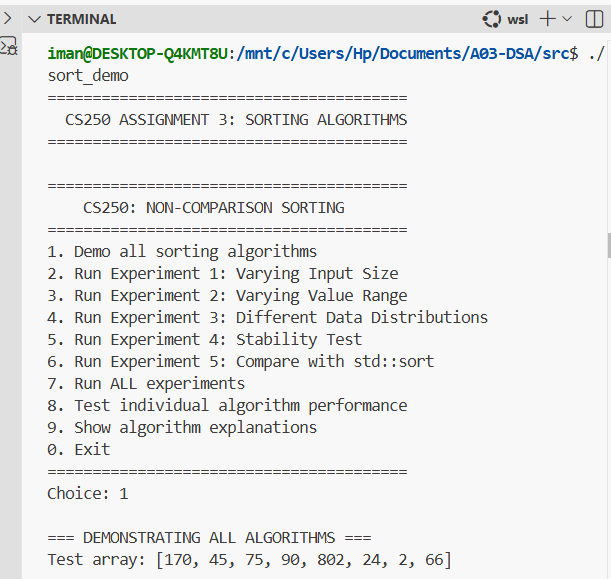

# Project Overview
This project implements and evaluates non-comparison sorting algorithms as required for CS250 Assignment 3. We explore Counting Sort (stable and non-stable variants), LSD Radix Sort, and two additional algorithms: Bucket Sort and Pigeonhole Sort. All implementations are in C++ and focus on key data structures, stability, complexity, and assumptions. Experiments compare performance across random, nearly sorted, and small-range inputs to demonstrate how input characteristics influence behavior.

## Project Structure
A03-DSA/
├── src/
│   ├── main.cpp                 # Entry point: Demonstrations, experiments, and analysis
│   ├── bucket_sort.cpp          # Bucket Sort implementation
│   ├── bucket_sort.h            # Bucket Sort header
│   ├── pigeonhole_sort.cpp      # Pigeonhole Sort implementation
│   ├── pigeonhole_sort.h        # Pigeonhole Sort header
│   ├── comparison_sort.cpp      # Counting Sort (stable/non-stable) and LSD Radix Sort
│   ├── comparison_sort.h        # Headers for Counting and Radix Sorts
│   ├── experiment_design.h      # Experiment setup (timers, generators, verifiers)
│   ├── utils.cpp                # Utility functions (array generation, etc.)
│   └── utils.h                  # Utility headers
├── Makefile                     # Build script for compilation
├── README.md                    # This file
└── .gitignore                   # Ignores build artifacts and temp files

### Compilation and Execution:
Compilation & Execution Instructions

### Prerequisites
Compiler: g++ (C++17 or later).
Dependencies: Standard Template Library (STL) only—no external libraries.

### Building the Project
Use the provided Makefile
Open a terminal in the project root (A03-DSA/).
Run:
make

### Install make on Windows Git Bash:
Option 1: Install via Chocolatey (Package Manager)
First install Chocolatey (if not installed):
# Run in PowerShell as Administrator
Set-ExecutionPolicy Bypass -Scope Process -Force; [System.Net.ServicePointManager]::SecurityProtocol = [System.Net.ServicePointManager]::SecurityProtocol -bor 3072; iex ((New-Object System.Net.WebClient).DownloadString('https://community.chocolatey.org/install.ps1'))

Then install make:
choco install make

Makefile is present is src folder. Use command: cd src to navigate to src folder after navigating to project directory.

This compiles all source files into an executable named sort_demo (or sorting_demo.exe on Windows).
Flags: -std=c++17 -O2 -Wall -Wextra for optimization and warnings.

### Manual Compilation
g++ -std=c++17 -O2 -Wall -Wextra -o sorting_demo src/*.cpp

After building, execute:
make run

Similarly, ./sorting_demov(Linux) or sorting_demo.exe(Windows)

### Expected Output:

Demonstrations: Sorts a sample array with each algorithm and verifies results.
Experiments: Performance timings (ms) for array sizes [1000, 5000, 10000, 50000] across input types (random, nearly sorted, small-range).
Stability Test: Compares stable vs. non-stable on duplicates.
Analysis: Prints key insights, space complexity, and recommendations.
Sample run time: <1 minute for all tests.

### Cleaning Build Artifacts
Run this command:
make clean

Removes sorting_demo and temporary files.

Troubleshooting
Errors on Windows? Use WSL or install MinGW; ensure paths use forward slashes.
Missing headers? Verify all .h files are in src/.
Slow performance? Disable -O2 for debugging.

### Features Implemented
Counting Sort: Stable (right-to-left placement) and non-stable (left-to-right) variants.
LSD Radix Sort: Digit-by-digit sorting using stable Counting Sort subroutine.
Bucket Sort: Distributes into √n buckets; sorts each with std::sort.
Pigeonhole Sort: Direct placement into range-sized slots.
Utilities:
Array generators: Random (0–1000), nearly sorted (5% swaps), small-range (0–49).
Timing: std::chrono for average over 3 runs.
Verification: Checks sorted order and stability.

Experiments: Modular design in experiment_design.h for custom cases.

### Dependencies:
C++ Standard: C++17 (for auto, chrono, etc.).
Build Tool: Make (optional; g++ works standalone).
No runtime dependencies beyond libc++.